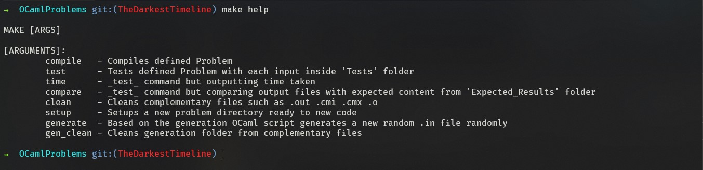
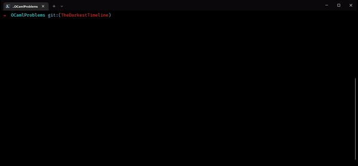
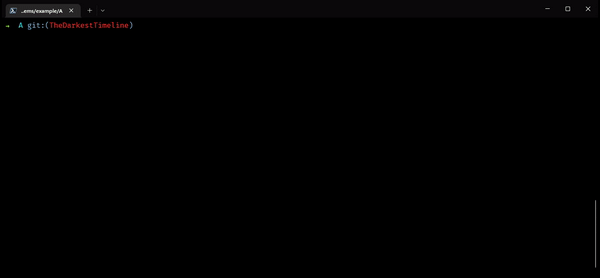
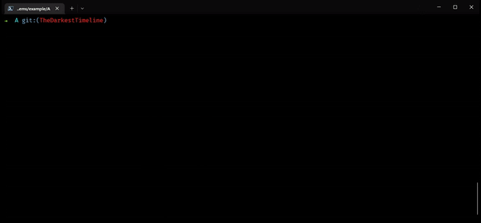

<div align="center">
  <a href="https://github.com/AshKetshup/Landmark">
    
  </a>

<h2 align="center">OCaml Makes Problems</h2>

  <p align="center">
    A Makefile template setup for OCaml Problems
  </p>
</div>

---

Problemas de Logica Computacional (LC), Teoria da Computação (TC), Programação Funcional (PF) (OCaml)


# Makefile

I made a makefile to start all problems from the same format and keep file organization.

### How it works?
I created a series of tools ready to ease productivity on a said OCaml Problem:

---

#### ```$ make help```

Said command outputs a guideline on what each command does.



---

#### ```$ make setup```

In order to start a new Problem we need to setup all folders in order to be ready for the task. Therefore we use this command on a created folder by creating a brand new `Makefile` referencing the path to the root Makefile and specifying what the name of the `PROBLEM` is.

Heres an example on how to do it:



---

#### ```$ make compile```

A simple way to compile things. It's used `ocamlopt` to compile it into a binary.
Compiles `.ml` file with the same name as the specified problem.



---

#### ```$ make test```

Since we need to test our problem with already known outcomes it is welcome a tool for test some inputs. With that in mind was also created a **Test** folder:


The folder **Tests** contains in its root input files (`*.in`) ready to be used in the OCaml Problem. From those, it's automatically generated output files (`*.out`) into the **Results** folder.

Here's an example on how to use it:



---

