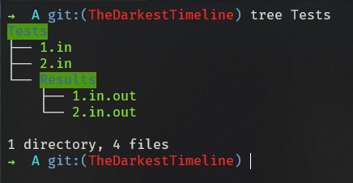

<div id="top"></div>

[![Contributors][contributors-shield]][contributors-url]
[![Forks][forks-shield]][forks-url]
[![Stargazers][stars-shield]][stars-url]
[![Issues][issues-shield]][issues-url]
[![MIT License][license-shield]][license-url]
[![LinkedIn][linkedin-shield]][linkedin-url]

<div align="center">
  <a href="https://github.com/AshKetshup/OCaml-Makes-Problems">
    
  </a>

  <h3>OCaml Makes Problems</h3>
  <p>A Makefile template setup for OCaml Problems</p>
</div>

---

Problemas de Logica Computacional (LC), Teoria da Computação (TC), Programação Funcional (PF) (OCaml)


# Makefile

I made a makefile to start all problems from the same format and keep file organization.

### How to start?
In order to start we need to download said Makefile to the root of the directory where you'll keep all your OCaml Problems.

You may download it by `wget`:

```bash
wget https://raw.githubusercontent.com/AshKetshup/OCaml-Makes-Problems/TheDarkestTimeline/Makefile
```


### How it works?
I created a series of tools ready to ease productivity on a said OCaml Problem:

---

#### ```$ make help```

Said command outputs a guideline on what each command does.


---

#### ```$ make setup```

In order to start a new Problem we need to setup all folders in order to be ready for the task. Therefore we use this command on a created folder by creating a brand new `Makefile` referencing the path to the root Makefile and specifying what the name of the `PROBLEM` is.

Heres an example on how to do it:


---

#### ```$ make compile```

A simple way to compile things. It's used `ocamlopt` to compile it into a binary.
Compiles `.ml` file with the same name as the specified problem.


---

#### ```$ make test```

Since we need to test our problem with already known outcomes it is welcome a tool for test some inputs. With that in mind was also created a **Test** folder:



The folder **Tests** contains in its root input files (`*.in`) ready to be used in the OCaml Problem. From those, it's automatically generated output files (`*.out`) into the **Results** folder.

Here's an example on how to use it:


---

<!-- MARKDOWN LINKS & IMAGES -->
<!-- https://www.markdownguide.org/basic-syntax/#reference-style-links -->
[contributors-shield]: https://img.shields.io/github/contributors/AshKetshup/OCaml-Makes-Problems.svg?style=for-the-badge
[contributors-url]: https://github.com/AshKetshup/OCaml-Makes-Problems/graphs/contributors
[forks-shield]: https://img.shields.io/github/forks/AshKetshup/OCaml-Makes-Problems.svg?style=for-the-badge
[forks-url]: https://github.com/AshKetshup/OCaml-Makes-Problems/network/members
[stars-shield]: https://img.shields.io/github/stars/AshKetshup/OCaml-Makes-Problems.svg?style=for-the-badge
[stars-url]: https://github.com/AshKetshup/OCaml-Makes-Problems/stargazers
[issues-shield]: https://img.shields.io/github/issues/AshKetshup/OCaml-Makes-Problems.svg?style=for-the-badge
[issues-url]: https://github.com/AshKetshup/OCaml-Makes-Problems/issues
[license-shield]: https://img.shields.io/github/license/AshKetshup/OCaml-Makes-Problems.svg?style=for-the-badge
[license-url]: https://github.com/AshKetshup/OCaml-Makes-Problems/blob/master/LICENSE.txt
[linkedin-shield]: https://img.shields.io/badge/-LinkedIn-black.svg?style=for-the-badge&logo=linkedin&colorB=555
[linkedin-url]: https://linkedin.com/in/diogo-simoes-8b5a0618a
